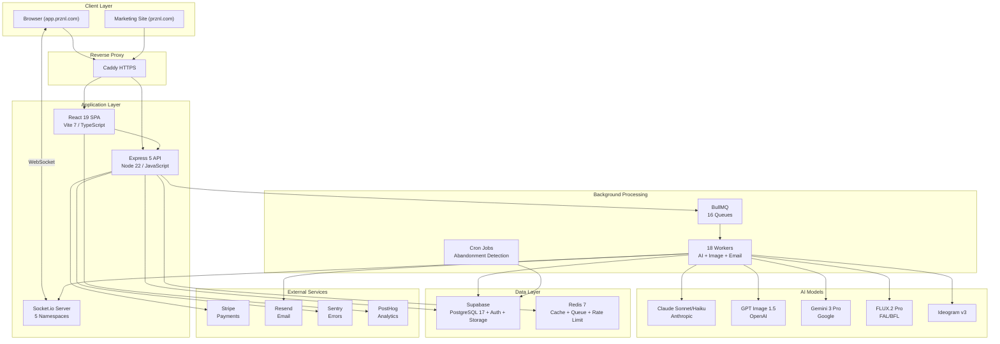
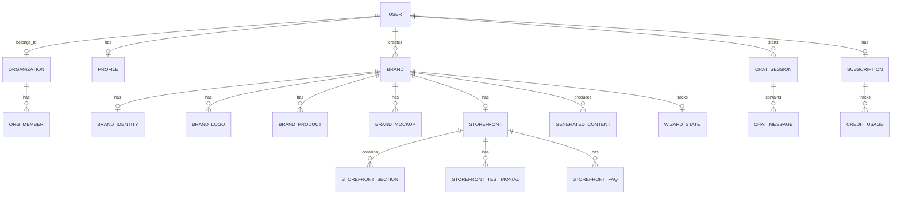
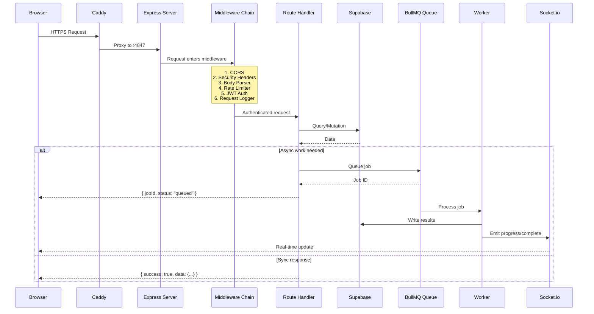

# Brand Me Now v2 -- System Architecture Overview

## High-Level Architecture

## Domain Model

## Request Flow (API Call)

## Technology Stack Summary

| Layer | Technology | Purpose |
|-------|-----------|---------|
| **Frontend** | React 19 + Vite 7 + TypeScript | SPA dashboard & wizard |
| **Backend** | Express 5 + Node 22 + JSDoc | REST API server |
| **Database** | Supabase (PostgreSQL 17) | Auth, DB, Storage, RLS |
| **Cache/Queue** | Redis 7 | BullMQ, rate limiting, caching |
| **Real-time** | Socket.io | Generation progress, chat |
| **AI Orchestration** | Anthropic Agent SDK | Chat agent with MCP tools |
| **Payments** | Stripe | Subscriptions + credits |
| **Email** | Resend | Transactional email |
| **Hosting** | DigitalOcean Droplet | Docker Compose + Caddy |
| **CI/CD** | GitHub Actions | Lint, test, build, deploy |
| **Monitoring** | Sentry + PostHog | Errors + analytics |
