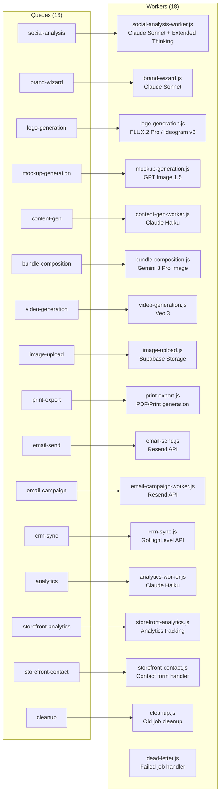
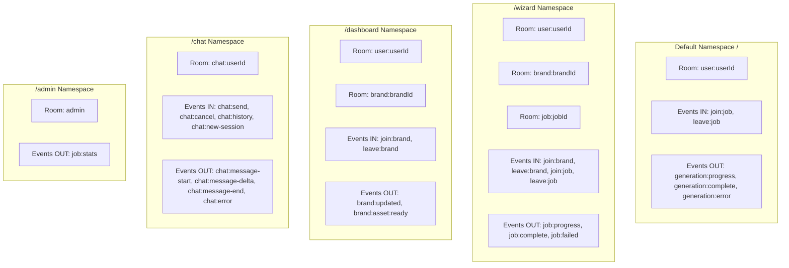
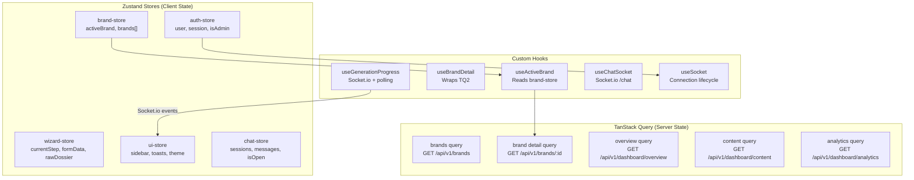
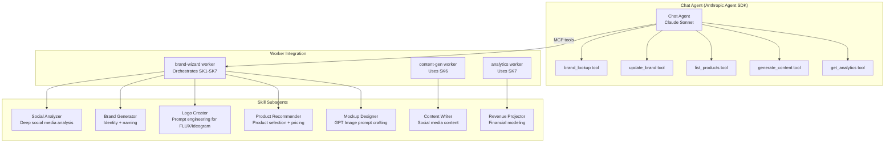
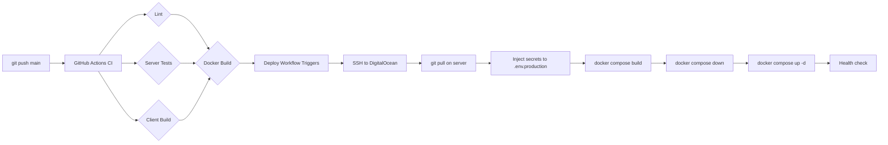

# Data Flow Map -- Every Component Traced

## End-to-End User Journey: Registration to Storefront

```mermaid
graph TD
    subgraph "1. Registration"
        A1[User visits app.prznl.com] --> A2[Supabase Google OAuth]
        A2 --> A3[Profile created in profiles table]
        A3 --> A4[Organization auto-created]
        A4 --> A5[Redirected to /dashboard]
    end

    subgraph "2. Brand Wizard"
        B1[User clicks Create Brand] --> B2[/wizard/onboarding]
        B2 --> B3[Enter social URLs]
        B3 --> B4[/wizard/social-analysis]
        B4 -->|Queue: social-analysis| B5[Social Analysis Worker]
        B5 -->|Claude Sonnet| B6[Analyze social presence]
        B6 --> B7[Write dossier to wizard_state]
        B7 -->|Socket.io: generation:complete| B8[Show results]
        B8 --> B9[/wizard/brand-quiz]
        B9 --> B10[AI quiz for preferences]
        B10 --> B11[/wizard/brand-identity]
        B11 -->|Queue: brand-wizard| B12[Brand Identity Worker]
        B12 -->|Claude Sonnet| B13[Generate identity]
        B13 --> B14[Write to brand_identities table]
        B14 --> B15[/wizard/brand-name]
        B15 -->|Claude Sonnet| B16[Generate brand names]
        B16 --> B17[User picks name]
        B17 --> B18[/wizard/logo-generation]
        B18 -->|Queue: logo-generation| B19[Logo Worker]
        B19 -->|FLUX.2 Pro / Ideogram| B20[Generate 4 logos]
        B20 --> B21[Upload to Supabase Storage]
        B21 --> B22[Write to brand_logos table]
        B22 --> B23[/wizard/product-selection]
        B23 --> B24[User picks products]
        B24 --> B25[/wizard/mockup-generation]
        B25 -->|Queue: mockup-generation| B26[Mockup Worker]
        B26 -->|GPT Image 1.5| B27[Generate mockups]
        B27 --> B28[Upload to Supabase Storage]
        B28 --> B29[Write to brand_mockups table]
        B29 --> B30[/wizard/completion]
        B30 --> B31[Brand status: complete]
    end

    subgraph "3. Dashboard"
        C1[/dashboard - Overview] --> C2[Brand Health Score]
        C1 --> C3[Revenue KPIs]
        C1 --> C4[Quick Actions]
    end

    subgraph "4. Storefront Builder"
        D1[/dashboard/storefront] --> D2[Load storefront sections]
        D2 --> D3[Edit Hero, Welcome, etc.]
        D3 --> D4[Save sections to storefront_sections]
        D4 --> D5[Publish Store]
        D5 --> D6[brandname.brandmenow.store]
    end

    A5 --> B1
    B31 --> C1
    C4 --> D1
```

## API Route Map

### Dashboard Routes (`/api/v1/dashboard/`)

| Route | Method | Handler File | Data Source | Writes To | Queue |
|-------|--------|-------------|-------------|-----------|-------|
| `/dashboard/overview` | GET | `server/src/routes/api/v1/dashboard/overview.js` | brands, brand_products, orders | - | - |
| `/dashboard/content` | GET | `server/src/routes/api/v1/dashboard/content.js` | generated_content | - | - |
| `/dashboard/content/generate` | POST | `server/src/routes/api/v1/dashboard/content.js` | brands, wizard_state | generated_content | `content-gen` |
| `/dashboard/analytics` | GET | `server/src/routes/api/v1/dashboard/analytics.js` | brands, brand_analytics | - | - |

### Brand Routes (`/api/v1/brands/`)

| Route | Method | Handler | Data Source | Writes To | Queue |
|-------|--------|---------|-------------|-----------|-------|
| `/brands` | GET | brands controller | brands | - | - |
| `/brands/:id` | GET | brands controller | brands, brand_identities, brand_logos, brand_products, brand_mockups | - | - |
| `/brands` | POST | brands controller | - | brands | - |
| `/brands/:id` | PATCH | brands controller | brands | brands | - |
| `/brands/:id` | DELETE | brands controller | brands | brands (soft delete) | - |
| `/brands/:id/identity` | GET/PATCH | brands controller | brand_identities | brand_identities | - |
| `/brands/:id/logos` | GET | brands controller | brand_logos | - | - |
| `/brands/:id/generate/logos` | POST | brands controller | brands | - | `logo-generation` |
| `/brands/:id/generate/mockups` | POST | brands controller | brands | - | `mockup-generation` |
| `/brands/:id/mockups/:mid` | PATCH | brands controller | brand_mockups | brand_mockups | - |

### Wizard Routes (`/api/v1/wizard/`)

| Route | Method | Handler | Data Source | Writes To | Queue |
|-------|--------|---------|-------------|-----------|-------|
| `/wizard/start` | POST | wizard controller | - | brands, wizard_state | - |
| `/wizard/:brandId/step` | PATCH | wizard controller | wizard_state | wizard_state | Various |
| `/wizard/:brandId/state` | GET | wizard controller | wizard_state | - | - |
| `/wizard/:brandId/resume` | GET | wizard controller | wizard_state | - | - |

### Storefront Routes (`/api/v1/storefronts/`)

| Route | Method | Handler | Data Source | Writes To |
|-------|--------|---------|-------------|-----------|
| `/storefronts` | GET | storefront controller | storefronts | - |
| `/storefronts/:id` | GET | storefront controller | storefronts, storefront_sections | - |
| `/storefronts/:id/sections` | GET/PUT | storefront controller | storefront_sections | storefront_sections |
| `/storefronts/:id/publish` | POST | storefront controller | storefronts | storefronts |
| `/storefronts/:id/testimonials` | GET/POST | storefront controller | storefront_testimonials | storefront_testimonials |
| `/storefronts/:id/faqs` | GET/POST | storefront controller | storefront_faqs | storefront_faqs |

### Auth Routes (`/api/v1/auth/`)

| Route | Method | Handler | Data Source | Writes To |
|-------|--------|---------|-------------|-----------|
| `/auth/me` | GET | auth controller | Supabase Auth, profiles | - |
| `/auth/profile` | PATCH | auth controller | profiles | profiles |

### Payment Routes (`/api/v1/payments/`)

| Route | Method | Handler | Data Source | Writes To |
|-------|--------|---------|-------------|-----------|
| `/payments/checkout` | POST | payments controller | profiles | Stripe session |
| `/payments/portal` | POST | payments controller | profiles | Stripe portal |
| `/payments/webhook` | POST | payments controller | Stripe events | subscriptions, profiles |

## BullMQ Queue and Worker Map



## Socket.io Namespace Map



## Client State Management



## AI Agent Architecture



## Middleware Chain (server/src/app.js)

```
Request
  |
  v
1. CORS (cors) -- Allow app.prznl.com, api.prznl.com origins
  |
  v
2. Security Headers (security-headers.js) -- CSP, HSTS, X-Frame-Options
  |
  v
3. Body Parser (express.json) -- Parse JSON bodies, 10MB limit
  |
  v
4. Request ID (x-request-id header) -- Correlation ID for tracing
  |
  v
5. Request Logger (pino) -- Structured JSON logging
  |
  v
6. Rate Limiter (express-rate-limit + Redis) -- Per-IP rate limiting
  |
  v
7. Stripe Webhook (raw body) -- /api/v1/payments/webhook only
  |
  v
8. Auth Middleware (JWT verification) -- Supabase JWT, attaches req.user
  |
  v
9. Route Handler -- Business logic
  |
  v
10. Error Handler -- Sentry capture + JSON error response
```

## Deployment Pipeline


