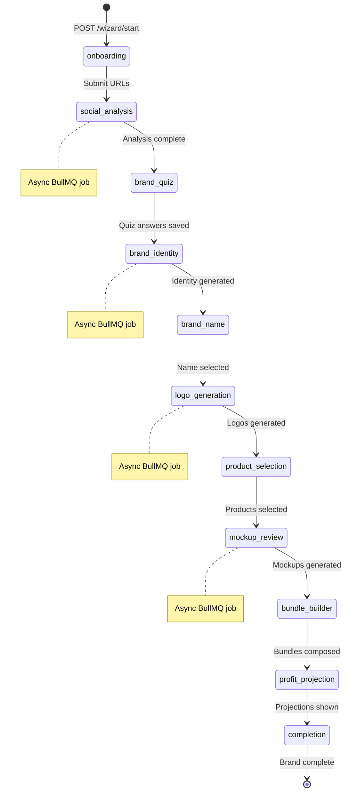
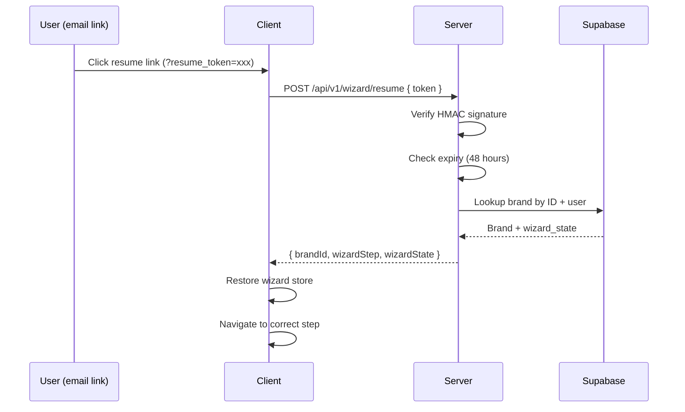

# Wizard Flow -- Step-by-Step Data Flow

## Complete Wizard Pipeline

```mermaid
graph TD
    subgraph "Phase 1: Discover"
        W1["/wizard/onboarding<br/>Enter social URLs + basic info"] -->|POST /wizard/start| W2[Create brand + wizard_state]
        W2 --> W3["/wizard/social-analysis<br/>Queue: social-analysis"]
        W3 -->|BullMQ job| W3W[Social Analysis Worker<br/>Claude Sonnet + Extended Thinking]
        W3W -->|Socket.io: job:progress| W3P[Show real-time progress]
        W3W -->|Write dossier| W3D[wizard_state.social-analysis]
        W3W -->|Socket.io: job:complete| W3C[Show results + Continue]
        W3C --> W4["/wizard/brand-quiz<br/>AI-generated preference quiz"]
        W4 --> W5["/wizard/brand-identity<br/>Queue: brand-wizard"]
        W5 -->|BullMQ job| W5W[Brand Generator Skill<br/>Claude Sonnet]
        W5W -->|Generate| W5D[Vision, Values, Archetype<br/>Color Palette, Fonts]
        W5D -->|Write| W5DB[brand_identities table]
    end

    subgraph "Phase 2: Design"
        W5DB --> W6["/wizard/brand-name<br/>Queue: brand-wizard"]
        W6 -->|Name Generator Skill| W6W[Claude Sonnet<br/>Domain + TM checks]
        W6W --> W6R[5-10 name suggestions]
        W6R -->|User picks| W6S[Update brands.name]
        W6S --> W7["/wizard/logo-generation<br/>Queue: logo-generation"]
        W7 -->|Logo Creator Skill| W7W[Recraft V4 via FAL.ai<br/>4 logo variations]
        W7W -->|Upload| W7S[Supabase Storage<br/>brand-logos/brandId/]
        W7S -->|Write| W7DB[brand_logos table]
        W7DB --> W8["/wizard/product-selection<br/>Queue: brand-wizard"]
        W8 -->|Product Recommender Skill| W8W[Claude Sonnet<br/>Catalog matching]
        W8W --> W8R[Recommended products<br/>with pricing]
        W8R -->|User selects| W8DB[brand_products table]
    end

    subgraph "Phase 3: Launch"
        W8DB --> W9["/wizard/mockup-review<br/>Queue: mockup-generation"]
        W9 -->|Mockup Renderer Skill| W9W[GPT Image 1.5<br/>Logo on products]
        W9W -->|Upload| W9S[Supabase Storage<br/>brand-mockups/brandId/]
        W9S -->|Write| W9DB[brand_mockups table]
        W9DB --> W10["/wizard/bundle-builder<br/>Queue: bundle-composition"]
        W10 -->|Gemini 3 Pro Image| W10W[Compose bundle images]
        W10W --> W10DB[brand_bundles table]
        W10DB --> W11["/wizard/profit-projection"]
        W11 -->|Profit Calculator Skill| W11W[Revenue modeling<br/>3 tiers]
        W11W --> W12["/wizard/completion"]
        W12 -->|Update| W12S[brands.status = 'complete']
        W12S --> W13[Redirect to Dashboard]
    end
```



## Wizard Step Data Map

| Step | Route | Queue | Worker/Skill | Input | Output (DB) | Socket Events |
|------|-------|-------|-------------|-------|-------------|---------------|
| Onboarding | `/wizard/onboarding` | - | - | Social URLs, name | `brands`, `wizard_state` | - |
| Social Analysis | `/wizard/social-analysis` | `social-analysis` | Social Analyzer (Sonnet) | Social URLs | `wizard_state.social-analysis` (dossier) | `job:progress`, `job:complete` |
| Brand Quiz | `/wizard/brand-quiz` | - | - | User preferences | `wizard_state.brand-quiz` | - |
| Brand Identity | `/wizard/brand-identity` | `brand-wizard` | Brand Generator (Sonnet) | Dossier + quiz answers | `brand_identities` (vision, values, archetype, colors, fonts) | `job:progress`, `job:complete` |
| Brand Name | `/wizard/brand-name` | `brand-wizard` | Name Generator (Sonnet) | Identity + dossier | `brands.name`, `wizard_state.brand-name` | `job:progress`, `job:complete` |
| Logo Generation | `/wizard/logo-generation` | `logo-generation` | Logo Creator (Recraft V4) | Brand identity + name | `brand_logos`, Supabase Storage | `job:progress`, `job:complete` |
| Product Selection | `/wizard/product-selection` | `brand-wizard` | Product Recommender (Sonnet) | Dossier + identity | `brand_products` | `job:progress`, `job:complete` |
| Mockup Review | `/wizard/mockup-review` | `mockup-generation` | Mockup Renderer (GPT Image 1.5) | Products + logos | `brand_mockups`, Supabase Storage | `job:progress`, `job:complete` |
| Bundle Builder | `/wizard/bundle-builder` | `bundle-composition` | Gemini 3 Pro Image | Selected products + mockups | `brand_bundles` | `job:progress`, `job:complete` |
| Profit Projection | `/wizard/profit-projection` | - | Profit Calculator (Sonnet) | Products + bundles + pricing | `wizard_state.profit-projection` | - |
| Completion | `/wizard/completion` | - | - | - | `brands.status = 'complete'` | - |

## Wizard State Machine



## Resume Flow



## Client State (wizard-store.ts)

```
wizard-store (Zustand)
├── meta
│   ├── brandId: string
│   ├── currentStep: string
│   ├── isGenerating: boolean
│   └── error: string | null
├── brand
│   ├── name: string
│   ├── archetype: string
│   ├── values: string[]
│   └── vision: string
├── design
│   ├── colorPalette: Color[]
│   ├── fonts: { primary, secondary }
│   └── logoUrl: string
├── social
│   └── rawDossier: object (excluded from persistence)
└── products
    ├── selected: Product[]
    └── bundles: Bundle[]
```
