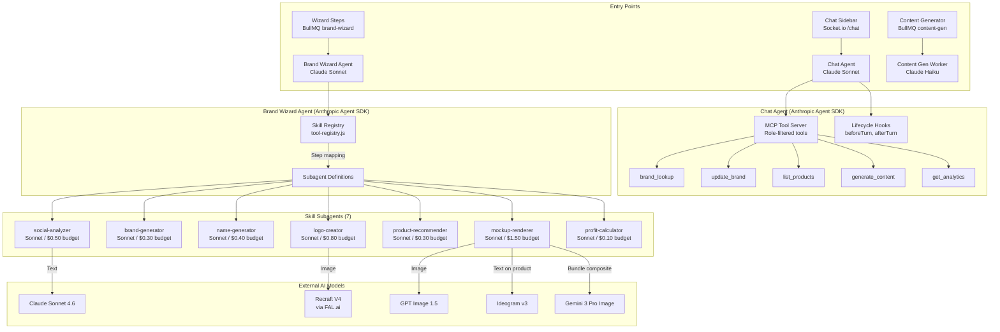
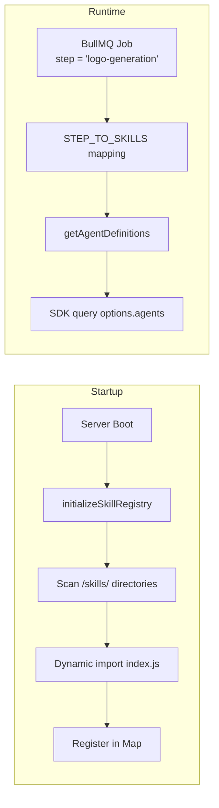
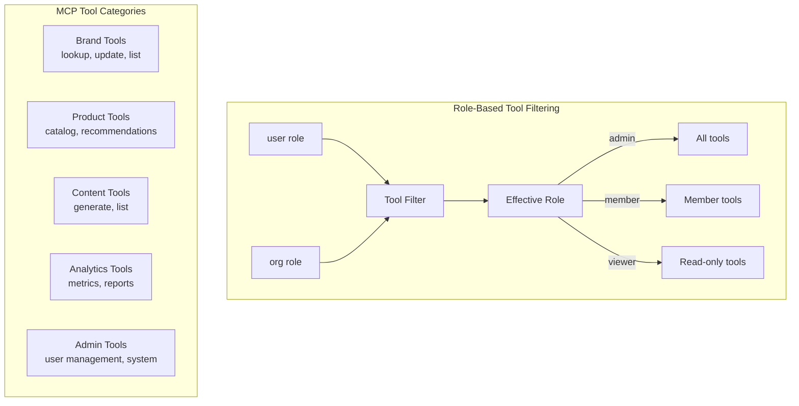

# AI Agent System -- Model Routing & Skill Architecture

## Agent Architecture Overview



## Model Router (model-router.js)

Routes text tasks to the optimal model with automatic fallback.

| Task Type | Primary Model | Provider | Fallback | Cost/1k tokens |
|-----------|--------------|----------|----------|----------------|
| `brand-vision` | Claude Sonnet 4.6 | Anthropic | Gemini 3.1 Pro | $0.009 |
| `social-analysis` | Claude Sonnet 4.6 | Anthropic | Gemini 3.1 Pro | $0.009 |
| `name-generation` | Claude Sonnet 4.6 | Anthropic | Claude Haiku 4.5 | $0.009 |
| `chatbot` | Claude Haiku 4.5 | Anthropic | Gemini 3 Flash | $0.0024 |
| `extraction` | Claude Haiku 4.5 | Anthropic | Gemini 3 Flash | $0.0024 |
| `validation` | Gemini 3 Flash | Google | Claude Haiku 4.5 | $0.000375 |
| `large-context` | Gemini 3.1 Pro | Google | Claude Sonnet 4.6 | $0.005625 |
| `context-analysis` | Claude Haiku 4.5 | Anthropic | Gemini 3 Flash | $0.0024 |
| `brand-validation` | Claude Haiku 4.5 | Anthropic | Gemini 3 Flash | $0.0024 |

## Image Generation Models

| Task | Model | Provider | Worker | Output |
|------|-------|----------|--------|--------|
| Logo generation | Recraft V4 | FAL.ai | `logo-generation.js` | 4 variations, square HD |
| Product mockups | GPT Image 1.5 | OpenAI | `mockup-generation.js` | Logo on product renders |
| Text-on-product | Ideogram v3 | Ideogram | `mockup-generation.js` | Typography renders |
| Bundle composition | Gemini 3 Pro Image | Google | `bundle-composition.js` | Multi-product scenes |
| Product videos | Veo 3 | Google | `video-generation.js` | Short showcase videos |

## Skill Registry Architecture



### Step-to-Skill Mapping

```
social-analysis    → [social-analyzer]
brand-identity     → [brand-generator, name-generator]
logo-generation    → [logo-creator]
logo-refinement    → [logo-creator]
product-selection  → [product-recommender]
mockup-generation  → [mockup-renderer]
bundle-composition → [mockup-renderer]
profit-projection  → [profit-calculator]
completion         → []
```

## Skill Configuration Summary

| Skill | Model | Max Turns | Budget | Timeout | Tools |
|-------|-------|-----------|--------|---------|-------|
| social-analyzer | Claude Sonnet 4.6 | 15 | $0.50 | 120s | Social scraping, audience analysis |
| brand-generator | Claude Sonnet 4.6 | 10 | $0.30 | 60s | Identity generation, color/font selection |
| name-generator | Claude Sonnet 4.6 | 12 | $0.40 | 90s | Domain checks, TM lookups (5-10 suggestions) |
| logo-creator | Claude Sonnet 4.6 | 20 | $0.80 | 180s | Recraft V4 generation (4 variants, max 3 refinements) |
| product-recommender | Claude Sonnet 4.6 | 12 | $0.30 | 60s | Catalog lookup, niche analysis, revenue estimation |
| mockup-renderer | Claude Sonnet 4.6 | 30 | $1.50 | 300s | GPT Image 1.5, Ideogram v3, Gemini 3 Pro |
| profit-calculator | Claude Sonnet 4.6 | 6 | $0.10 | 30s | Margin calc, 3-tier projections |

## Chat Agent Tool Server



## AI Cost Estimation Per Brand

| Phase | Skill | Estimated Cost |
|-------|-------|---------------|
| Social Analysis | social-analyzer | ~$0.15 |
| Brand Identity | brand-generator | ~$0.10 |
| Name Generation | name-generator | ~$0.08 |
| Logo Generation | logo-creator (text) + Recraft V4 (images) | ~$0.30 + ~$0.40 |
| Product Selection | product-recommender | ~$0.05 |
| Mockup Generation | mockup-renderer (text) + GPT Image (images) | ~$0.15 + ~$1.00 |
| Bundle Composition | Gemini 3 Pro Image | ~$0.50 |
| Profit Projection | profit-calculator | ~$0.03 |
| **Total per brand** | | **~$2.76** |
